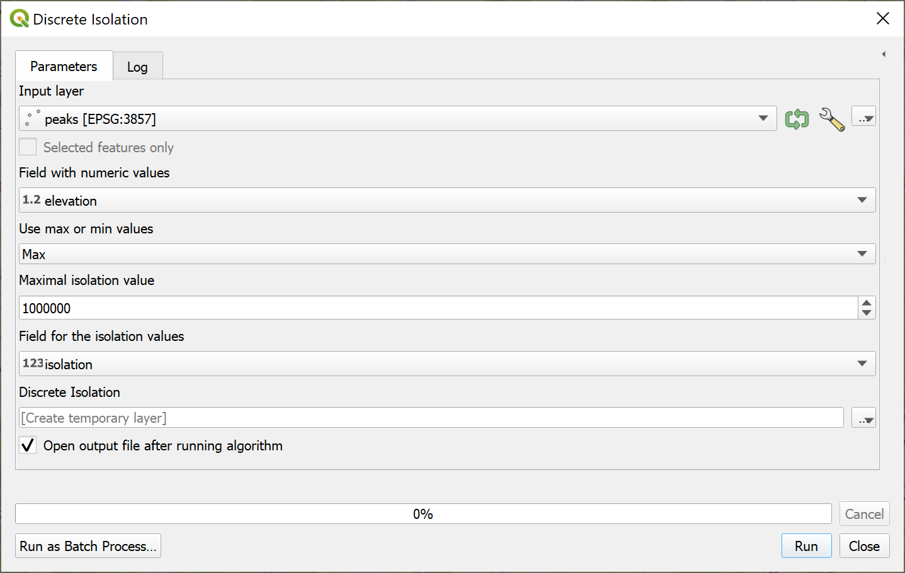
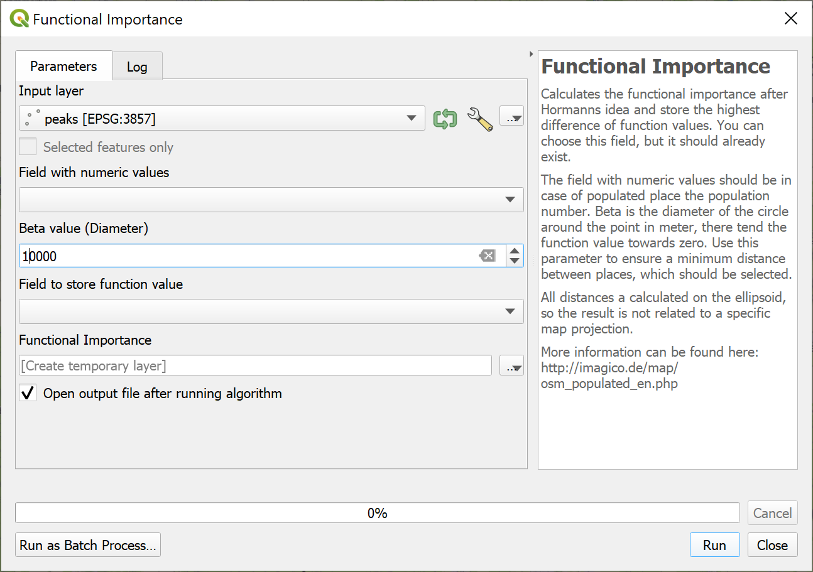
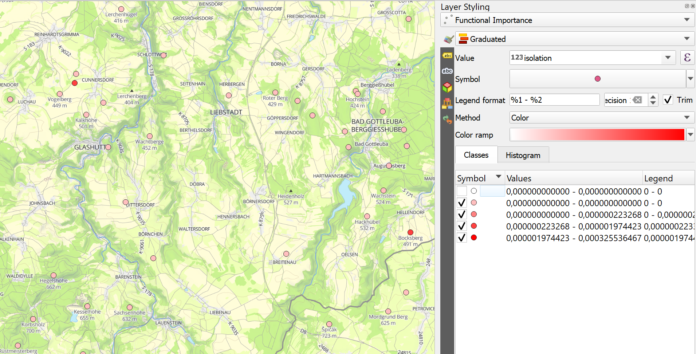
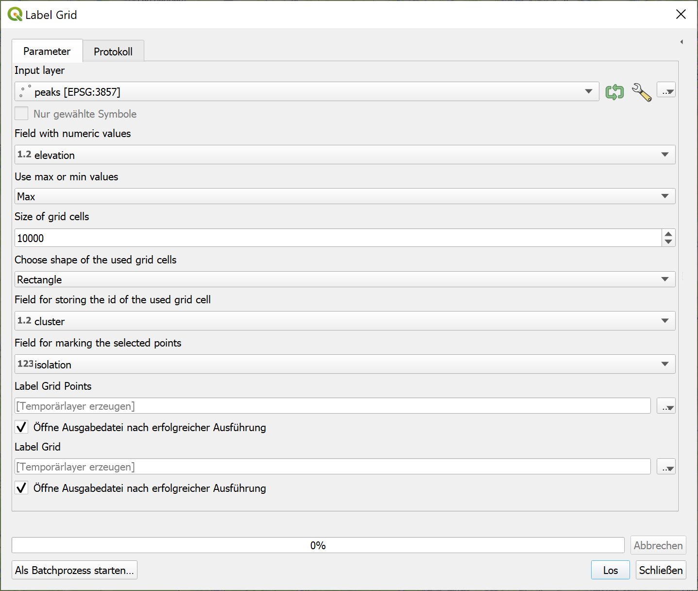

# Point selection algorithms

QGIS-Plugin for making different point selection algorithms available:

 - Discrete isolation (Gröbe)
 - [Functional importance](http://imagico.de/map/osm_populated_en.php) (Hormann)
 - [Label grid](https://github.com/mapbox/postgis-vt-util/blob/master/src/LabelGrid.sql) (MapBox)
 
These QGIS tools can help to identify local minimal and maximal in a point data set. This can be useful for cartographic generalization or analysis. While the Discrete isolation and the Functional importance not depending on the map projection, the Label grid relies on the point data's projection.

## Discrete isolation

Calculates the discrete isolation distance for points with numerical attributes. The isolation is the distance from one point to the closest point with a higher (Max option) or lowest (Min option) attribute value. As attribute value can be used every numerical attribute, e.g., the elevation (for peaks) or the population (for populated places). The isolation distance is always calculated in meters based on the ellipsoid.

The output can be visualized with a graduated layer.

## Functional importance

Calculates the functional importance after Hormann's idea and store the highest difference of function values. You can choose this field, but it should already exist. The field with numeric values should be in case of populated place the population number. Beta is the circle's diameter around the point in meters; there tends the function value towards zero. Use this parameter to ensure a minimum distance between places, which should be selected.

The output can be visualized with a graduated layer.

## Label grid

Creates a grid and check which point is contained by which grid cell. Afterward, the highest (Max option) point or the lowest (Min option) value in each will set to 1 and all others to 0 in the column for the selected points. You can choose which type of grid you prefer for computing: Rectangles, diamonds, or hexagons. The tool will create them according to your defined size. Please provide two numerical columns for storing the grid cell's id and none for holding the selection. The column for the grid id can be used for inspection; a value of -1 means that the point lays in no grid cell

The output can be visualized with a categorized layer; you can also add the grid as a reference.

The example is based on peaks from OpenStreetMap. You can also use other numerical attributes for points, e.g., the population for cities.
