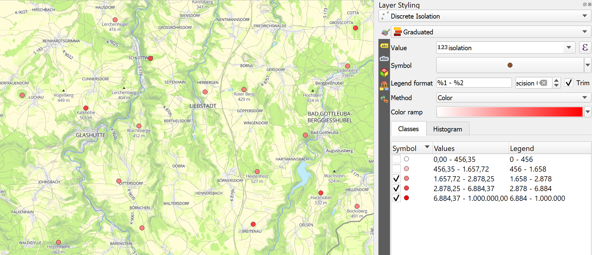
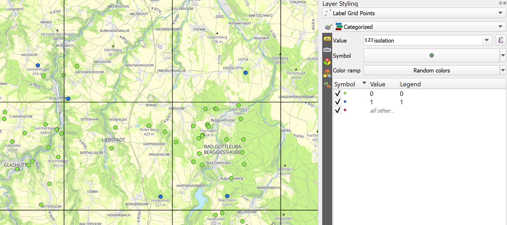

# Point selection algorithms

QGIS-Plugin for making different point selection algorithms available:

 - Discrete isolation (Gröbe)
 - [Functional importance](http://imagico.de/map/osm_populated_en.php) (Hormann)
 - [Label grid](https://github.com/mapbox/postgis-vt-util/blob/master/src/LabelGrid.sql) (MapBox)
 
These QGIS tools can help to identify local minimal and maximal in a point data set. This can be useful for cartographic generalization or analysis. While the Discrete isolation and the Functional importance not depending on the map projection, the Label grid relies on the point data's projection.

## Examples

### Discrete isolation

Calculates the discrete isolation distance for points with numerical attributes. The isolation is the distance from one point to the closest point with a higher (Max option) or lowest (Min option) attribute value. As attribute value can be used every numerical attribute, e.g., the elevation (for peaks) or the population (for populated places). The isolation distance is always calculated in meters based on the ellipsoid.


The output can be visualized with a graduated layer.



### Functional importance

Calculates the functional importance after Hormann's idea and store the highest difference of function values. You can choose this field, but it should already exist. The field with numeric values should be in case of populated place the population number. Beta is the circle's diameter around the point in meters; there tends the function value towards zero. Use this parameter to ensure a minimum distance between places, which should be selected.


The output can be visualized with a graduated layer.


### Label grid

Creates a grid and check which point is contained by which grid cell. Afterward, the highest (Max option) point or the lowest (Min option) value in each will set to 1 and all others to 0 in the column for the selected points. You can choose which type of grid you prefer for computing: Rectangles, diamonds, or hexagons. The tool will create them according to your defined size. Please provide two numerical columns for storing the grid cell's id and none for holding the selection. The column for the grid id can be used for inspection; a value of -1 means that the point lays in no grid cell


The output can be visualized with a categorized layer; you can also add the grid as a reference.



#### How to get and prepeare the example data

The examples are made with data about peaks from OpenStreetMap. You can also use other numerical attributes for points, e.g., the population for cities. For getting the data, you can use the [Overpass API](overpass-turbo.eu/). If you want to extract the peaks, you have to search for the tag combination `natural=peak`. A query like this will do this:

```
[out:json][timeout:25];
// gather results
(
  // query part for: “natural=peak”
  node["natural"="peak"]({{bbox}});
  way["natural"="peak"]({{bbox}});
  relation["natural"="peak"]({{bbox}});
);
// print results
out body;
>;
out skel qt;
```

Better do this for a small than a larger region, or you will run into problems. Afterward, export the result as GeoJSON and load it into QGIS. For using the Label grid, you have to project the data, the Webmercator is always possible, but not the right choice in general. Additionally, you have to convert the `ele` attribute from text to number with the help of the field calculator and this ` try(to_real("ele"), 0)` expression. To store the isolation, importance, selection, etc., you have to add another numeric field to the data.
